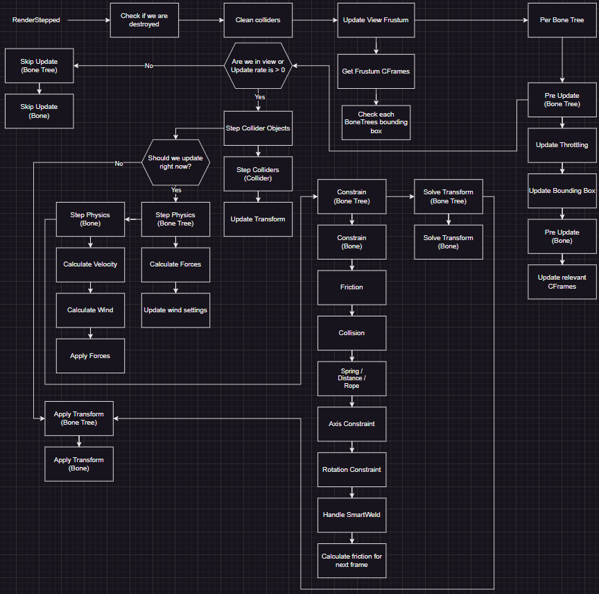

# Intro

## SmartBone 2 Crash Course

***(From now on I'll refer to SmartBone 2 as SmartBone)***

There are multiple ways to work with SmartBone, here I will cover the basic side of setting up attributes and using the runtime.

First of all you need to setup SmartBone! You can find the latest release with a rbxm, rbxl and source code zip [here](https://github.com/CelnakRBLX/SmartBone-2/releases)

If you're working in studio you will want to download the rbxm and drag it into your game. If you just want to play around with a demo then open the rbxl file. If you're using rojo or something similar then you can use the source code (.zip)

### Basic Setup

Take the SmartBone module and move it into ReplicatedStorage, and script in StarterPlayerScripts with this as the source:

```lua
local SmartBone = require(game:GetService("ReplicatedStorage"):WaitForChild("SmartBone"))

SmartBone.Start() -- Start the runtime
```

This is all you have to do for coding, now we just setup your mesh with the tags and attributes.

- Select any MeshPart with Bones under it

- Add the tag “SmartBone” to the MeshPart.

- Add a string attribute called “Roots” to the MeshPart and fill it with the name(s) of the bone(s) you want to be root(s).

- Separate each bone name with “,” and the Module will automatically sort your bone(s) into a list.

- An example of a SmartBone object with multiple roots would have a Roots attribute that looks like this: “Root1,Root2,Root3”

- Make sure you don’t add any spaces or characters unless they are part of the name of the bone(s) you want to be included

If you press play your mesh should start simulating, you can change other attributes found [here](smartbone.md).

### Axis Limits

Let's say you've got a cape and you don't want that cape to clip into the character, you can fix that using axis limits!

Axis limits are a powerful tool useful where setting up colliders would be overkill and a waste of performance.

You can limit a bone to moving between 0 studs and 5 studs on the x axis relative to the root part using an attribute called "XAxisLimits" of type NumberRange.


(This was running at 60fps but gif compression reduced it to 10fps)

### Colliders

**Note:** If you can use axis limits to achieve the same result, do not use a collider. It would be both a waste of performance and a waste of time to setup!

Colliders can be setup via a tag with the name "SmartCollider", you can optimize colliders using a collider key, create a string attribute called "ColliderKey" on your root part and your collider. Now only colliders with that collider key can collide with your object.

You can also manually change the shape of a collider using a string attribute called "ColliderShape" with an option of "Box", "Capsule", "Cylinder" and "Sphere".

## Update Flow Chart


## Related Documentation

[API](/SmartBone-2/api/)

[SmartBone Attributes](smartbone.md)

[SmartCollider Attributes](smartcollider.md)

[Bone Attributes](bone.md)
